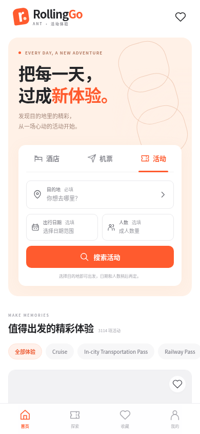
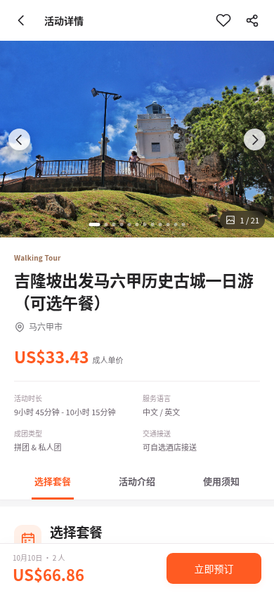
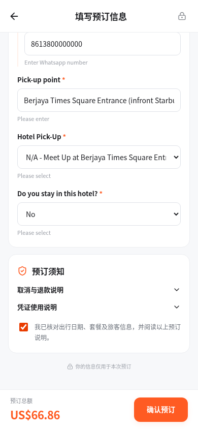
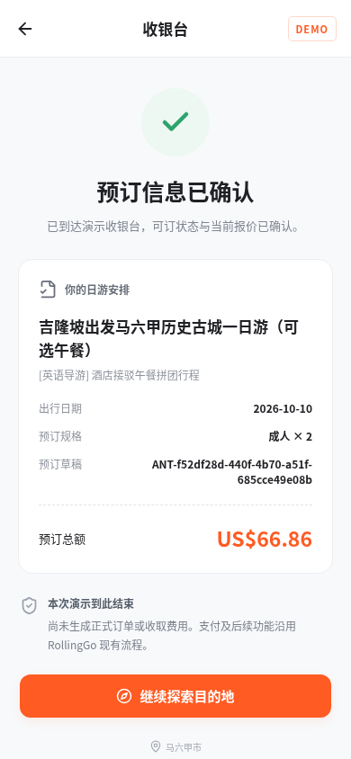

# 本次接续状态（2026-10-08）

本地已接手 main，Sites 原生工具可用，项目 ID `appgprj_6ac76e7113d4819198e9d90830476ccc` 已持久化于 `.openai/hosting.json`。

- 已读取指定 Figma 并校准；证据见 `docs/figma/calibration.md`。
- 正式 Worker 网关：`server/worker.mjs`；Node/Worker 共用契约：`server/gateway-core.mjs`。
- `npm run build` 生成 `dist/client/` 与 `dist/server/index.js`；`scripts/validate-worker.mjs` 验证实际编译入口及静态/API隔离。
- Node 26 项与 Worker 25 项契约测试通过；测试响应为 mock，不代表真实供应商联调。
- 新项目环境变量为空，本机未继承 `DIDA_API_KEY`。已经请用户在项目安全设置添加同名 Secret，禁止在聊天提供密钥。真实手机商品流程和域名接入须等待该绑定及上线验收。
- 详细部署结果后续记录在 `deployment/README.md`。不复用原环境的凭据，也不伪造数据兜底。

以下是原环境的历史交接记录。其真实数据、价格、截图和工具限制均属于当时环境，不是本次 Sites 验收结果。

---

# RollingGo ANT：部署与产品交接

更新日期：2026-10-08。用户决定换一个具备发布能力的环境继续工作。本仓库交付的是可运行的应用和服务端代理；当前环境未发布任何 ChatGPT Sites 站点，也未修改域名 DNS。

## 下一步的目标

**先发布到 ChatGPT Sites 的默认 HTTPS 地址，实际验收后再把 `ant.devdemo.cc` 引向该站点。** 域名由阿里云管理；DNS 和真实收银台接入不是发布默认地址的前置条件。

用户已授权制作、运行和发布该 Demo。请完成已授权工作，遇到能力缺失时指出具体缺口，不反复向用户确认已经确定的产品需求。可直接使用 [下一位 agent 的完整 prompt](NEXT_AGENT_PROMPT.md)。

## 已确认的产品需求

- 游客端，优先手机版；首页「活动」为与酒店、机票并列的第三个 Tab。
- 搜索目的地必填；日期范围选填，允许当天到当天；人数选填，只填成人。日期和人数不填时也能展示目的地商品。
- 使用 Klook 手机端的活动浏览、详情、套餐和预订展示方式，视觉语言以用户 Figma 为准。
- 所有商品内容、图片、套餐、SKU、价格、库存和资料规则必须来自供应商 API；不伪造评分、评论、销量、库存、套餐、时间或优惠。
- 流程为搜索 → 商品列表 → 详情 → 套餐／日期／数量 → 预订资料 → 校验报价 → **DEMO 收银台，至此结束**。
- 不创建供应商正式订单、不付款、不结算。当前后端已从代码中移除真实创建与支付分支，不能通过环境变量开启。

## 当前实现与文件

| 文件 | 内容 |
| --- | --- |
| `src/Catalog.tsx`、`catalog.css` | 首页入口、目的地／日期／成人选择、真实商品列表、分类和分页 |
| `src/ProductDetail.tsx`、`detail.css` | 真实描述与图片、套餐、日历、数量及库存／截止时间 |
| `src/Booking.tsx` | 联系人及动态附加资料、库存刷新、报价变化后二次确认 |
| `src/App.tsx`、`styles.css` | 页面路由、演示收银台和基础样式 |
| `server/index.mjs` | 同源 API 网关，固定供应商和允许路径；只校验生成草稿 |
| `server/extra-info-contract.md` | 附加资料提交结构的真实验证证据与未确认边界 |
| `tests/` | 公开 schema 夹具验收、真实只读浏览、真实验证草稿流程 |
| `deployment/README.md`、`Dockerfile` | 部署合同、运行时边界和 Node 包装；Docker 未实际构建验证 |
| `docs/verification.json` | 最终真实浏览验收的安全结果摘要 |

应用没有生产模拟数据兜底。测试夹具只在浏览器验收时拦截使用。商品目录为空、接口报错或缺少安全凭据时会显示对应状态。

## 设计参考

- 现有首页：[Figma，node 3527-5152](https://www.figma.com/design/cP2IZhFbGvnjbQTluorCGO/AI-Lab-2026Q3?node-id=3527-5152)。
- 视觉语言：[Figma，node 2957-28207](https://www.figma.com/design/cP2IZhFbGvnjbQTluorCGO/AI-Lab-2026Q3?node-id=2957-28207)。

本环境没有可调用的 Figma MCP；普通 Figma 请求在代理 CONNECT 阶段返回 `Domain forbidden`，未读到实际 frame。Klook 正常页面返回验证页面。**当前画面是按已确认需求制作的视觉初稿，尚未完成指定 Figma 的像素校准。** 下一环境应优先使用真正接入的 Figma MCP 读取 frame；成功之前不要声称已完全复刻。

## 数据与安全配置

API 文档：<https://didatickettest.wysiwysi.com/api/distribution/docs/>。

固定接口基址：`https://didatickettest.wysiwysi.com/api/distribution/v1`。Bearer 认证和 `Accept-Language: zh-CN` 由服务端使用。

必须通过新环境／部署平台的安全设置提供 **`DIDA_API_KEY`**。本仓库、交接文档和 prompt 均不包含密钥值；原环境绑定不等于已经绑定在新的 Sites 项目。先检查已有绑定、变量名称和存在状态，尝试代表性真实读取，再要求补充确实缺失的配置。禁止把密钥写进聊天、源码、Git、`VITE_*`、浏览器或构建产物。

网络目的地：

- API：`didatickettest.wysiwysi.com`。
- API 返回的商品图：`didatickettest.oss-cn-hongkong.aliyuncs.com`。
- 设计读取按实际 MCP／平台需求配置；不要为网络排错扩大至全网或关闭 TLS 验证。

重要的 API 映射：

- 商品编码可能包含字母，始终保留为字符串。
- 目录接口没有日期／人数库存过滤参数，搜索条件保留到套餐环节确认；页面对此有说明。
- 目录价格可为 `null` 或上游返回的 `0.00`，不可把婴儿零价当成人价。列表显示「选择套餐查看价格」，套餐以真实成人日历和验证报价为准。
- 日历使用当地完整时间，支持 `+08:00` 等时区偏移；不生成缺失场次。日历／库存／订单校验不缓存。
- 联系人固定使用 `first_name`、`family_name`、`mobile`；`name_english` 是填写规则，不是请求字段名。
- 已确认文本附加信息为 `{key,content}`，单选为 `{key,selected:[{key,content}]}`。选项自身要求的文本位于选项 `content` 内。
- 即使旅客资料规则为空，也须按 SKU 数量逐人发送 `{sku_code,index:1..count,extra_info:[]}`。
- 非空旅客资料、复杂嵌套字段的全部序列化尚未真实确认。已知必填 checkbox 套餐的上游格式不明确，前端明确提示选择其他套餐；详见服务端契约记录。不要把一份日游验收推广为全部 3,114 个商品都可下单。

## 已完成的验证

`npm run build` 通过；服务端契约测试 **26/26**，手机模拟场景 **7/7**。

真实 API 当次返回 457 个城市、3,114 个商品；代表商品 `105`「吉隆坡出发马六甲历史古城一日游（可选午餐）」有 7 个套餐。套餐 `23D` 成人 SKU `3OIQM5X`，成人单价 USD 33.43，最低两人合计 **USD 66.86**。这些是当次报价和统计，不应硬编码进页面。

最终使用**新网关与浏览器在同一受控执行上下文**完成真实资料校验到演示收银台。商品图与预订缩略图自然宽度均为 3000，图片失败 0，API 错误 0，页面错误 0，无手机横向溢出。联系人是合成测试资料，供应商订单创建和支付均未发生。

当前视觉截图来自这次成功验收：

| 首页 | 详情 |
| --- | --- |
|  |  |

| 预订资料（合成联系人） | 演示收银台 |
| --- | --- |
|  |  |

运行环境注意事项：

1. 跨工具沿用的旧后台网关曾在完整浏览流程中出现供应商 `401 / 1501 Unauthorized`；同期直接请求和网关复核均可 200，根因未确认。重绑密钥没有依据。启动新网关与浏览器于同一执行上下文后，完整真实流程通过。新环境不要沿用旧进程，必须自己做正向授权读取和浏览验收。
2. 本环境浏览器的既有 `/home/agent/.pki/nssdb` 已有正确平台 CA，但工作区文件系统沙箱阻止 NSS 正常初始化／访问，导致图片 `ERR_CERT_AUTHORITY_INVALID`。经受控权限审查让浏览器正常使用既有库后，HTTPS 图片成功。不要改 `HOME`、忽略 TLS 错误、覆盖证书库或盲目重复导入 CA。诊断中临时新增的证书库已经清理。
3. 上述属于当前云环境观察；新环境和 Sites 项目应按实际结果判断，不复制临时代理配置或凭据。

## 如何启动和复核

要求 Node **24.5+**。使用锁文件安装：

```sh
npm ci
npm run build
npm test
```

在当前受限缓存环境可使用 `npm ci --cache /workspace/.cache/rollinggo-ant/npm --no-fund --no-audit`。`scripts/cloud-setup.sh` 已实际执行验证。

开发用 `npm run dev`，默认前端 5173、API 8787；可通过 `ANT_WEB_PORT` 和 `ANT_API_PORT` 指定其他空闲端口。生产用 `npm start`，默认 `PORT=3000`，同一 Node 进程同时提供 `dist/` 和 `/api/*`。端口存在不是就绪证据，须检查健康接口及真实城市／商品／套餐日历。

浏览器测试见 [tests/README.md](tests/README.md)。`live_browser_smoke.py` 只读并停在空联系人页；`live_cashier_smoke.py` 则显式使用合成联系人，通过固定验证网关到 DEMO 收银台。需要浏览器证书库权限时通过运行工具处理，不由脚本关闭证书校验。

## Sites 发布的执行顺序

1. 确认新环境真正提供 Sites 原生项目、部署、安全变量和部署状态工具。当前会话只有环境配置工具，无法创建 Sites 默认地址；这是工具缺失，不是用户未授权。
2. 先核实 Sites 运行时：本应用包含 Node API 服务，**不能只上传 `dist/`**。若平台使用 Worker，须把网关正式适配为平台支持的 `fetch` 处理器与资源／秘密绑定；当前代码没有完成该适配。保留固定上游、参数限制、同源策略、凭据脱敏、限流和报价核验。
3. 在该 Sites 项目安全绑定 API 密钥，确认图片域名和真实 API 读取。保留测试例与生产数据的隔离，不开启真实下单或付款。
4. 接入 Figma MCP 并校准指定画面，完成适当构建、测试和实际手机验收。
5. 使用 Sites 原生发布流程，查询状态到成功；交付真实默认 HTTPS 地址，验证首页、商品图、API、预订资料和演示收银台，并检查密钥未进入前端。
6. 默认地址验收后，再处理 `ant.devdemo.cc`。只使用平台实际给出的域名方案和 DNS 记录；不得猜测 CNAME、IP 或 TXT。

若 Sites 能力仍缺失，指出具体缺失工具并保留可审核产物；不要虚构地址、调用猜测的私有 REST 接口或静默改成其他托管平台。
